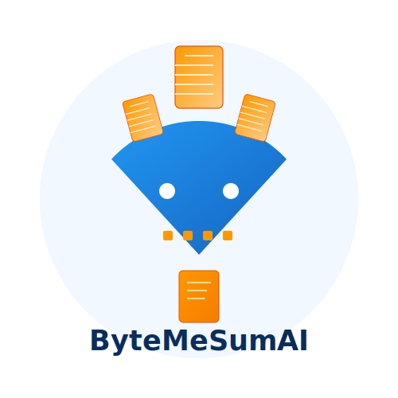

<p align="center">
  
</p>


# ByteMeSumAI


**Building Blocks for Robust and Context-Aware Retrieval-Augmented Generation**

## 🧩 Technical Overview

ByteMeSumAI is a toolkit for developers and technical practitioners implementing Retrieval-Augmented Generation (RAG) systems. It addresses critical document architecture challenges that impact RAG performance, offering specialized components for semantic document processing, context preservation, and intelligent content extraction.

This library provides the infrastructure necessary to transform raw documents into contextually rich, semantically structured inputs for downstream RAG systems - a foundational requirement for context-aware AI applications.

## 🔬 Technical Architecture

ByteMeSumAI follows a modular architecture designed around core document processing principles:

```
ByteMeSumAI
├── Chunking Engine        # Document segmentation with semantic awareness
├── Summarization Engine   # Multi-strategy content distillation
├── Document Processors    # Hierarchical document handling
├── Entity Tracking        # Cross-document entity reference management
└── Evaluation Framework   # Quantitative assessment of output quality
```

## 🧠 Core Technical Capabilities

### Chunking Techniques

- **Fixed-Size Chunking**: Baseline implementation with configurable chunk size and overlap parameters
- **Boundary-Aware Chunking**: Detects natural document boundaries (section breaks, topic shifts, format changes) to preserve semantic coherence 
- **Sentence-Preserving Algorithms**: Prevents sentence fragmentation that leads to context loss in RAG retrieval
- **Structure Preservation**: Maintains document hierarchies and relational elements, critical for agentic RAG's contextual understanding
- **[Planned] Semantic Chunking**: Future support for adaptive, content-aware segmentation that responds to document complexity

```python
from bytemesumai import chunk

# Configurable chunking parameters
chunks = chunk(
    document,
    strategy="boundary_aware",
    min_chunk_size=200,
    max_chunk_size=1500
)
```

### Summarization Methods

- **Basic Summarization**: Configurable concise/detailed summarization with length constraints
- **Extractive Summarization**: Identifies and preserves key sentences with statistical significance
- **Entity-Focused Summarization**: Maintains entity context across document sections, mitigating "entity amnesia" in RAG systems
- **Temporal Summarization**: Preserves chronological relationships, crucial for time-sensitive inference tasks
- **Multi-Document Summarization**: Synthesizes information across document sets while maintaining source attribution
- **Contrastive Summarization**: Highlights differences between documents, enabling comparative analysis

```python
from bytemesumai import summarize

# Entity-focused summarization that tracks key entities
summary = summarize(
    document,
    strategy="entity_focused",
    entities=["Company X", "Technology Y", "Regulation Z"]
)
```

### Document Processing Framework

- **Hierarchical Processing**: Multi-stage pipeline that maintains document structure hierarchy
- **Contextual Interlinking**: Preserves cross-references between document sections
- **Semantic Metadata Generation**: Creates structured metadata for improved RAG retrieval precision
- **Document Architecture Analysis**: Quantifies document complexity across multiple dimensions (entities, temporal scope, structural features)

```python
from bytemesumai import DocumentProcessor

processor = DocumentProcessor()
results = processor.process_document(
    document=doc,
    chunking_strategy="boundary_aware",
    summarization_strategies=["basic", "entity_focused", "temporal"],
    preserve_structure=True
)
```

### Evaluation Metrics

- **Boundary Preservation Assessment**: Quantifies integrity of document structure boundaries
- **Entity Coverage Analysis**: Measures entity representation and context preservation
- **Summary Quality Metrics**: Evaluates completeness, conciseness, accuracy and coherence
- **Temporal Coherence Analysis**: Assesses preservation of chronological structure
- **Cross-Document Reference Integrity**: Evaluates maintenance of inter-document dependencies

```python
from bytemesumai import evaluate_summary

evaluation = evaluate_summary(
    original_text=document,
    summary=summary,
    metrics=["completeness", "accuracy", "coherence"]
)
```

## 📊 Agentic RAG Integration Points

ByteMeSumAI is designed as a foundation for agentic RAG systems, with specific technical integration points:

| ByteMeSumAI Component | Agentic RAG Principle | Technical Integration |
|-----------------|-----------------|----------------------|
| Boundary-Aware Chunking | Document Structure Awareness | Preserves semantic boundaries for context-sensitive retrieval |
| Entity-Focused Summarization | Entity Tracking | Maintains entity context across document sections |
| Hierarchical Processing | Multi-Scale Context | Enables both local and global document understanding |
| Temporal Summarization | Chronological Coherence | Preserves time-based relationships in knowledge representation |
| Structure Preservation | Contextual Interlinking | Maintains cross-references for coherent reasoning |

## 🔍 Technical Implementation Examples

### Document Architecture Analysis for RAG Optimization

```python
from bytemesumai import Document, DocumentProcessor

# Load a complex document
doc = Document.from_file("technical_specification.pdf")

# Process with comprehensive analysis
processor = DocumentProcessor()
results = processor.process_document(doc)

# Extract document architecture metrics
architecture = results["document_info"]
print(f"Entity Complexity: {architecture['entity_complexity']}")
print(f"Temporal Scope: {architecture['temporal_scope']}")
print(f"Structural Complexity: {architecture['structural_complexity']}")

# Use metrics to optimize RAG parameters
if architecture["entity_complexity"] > 0.7:
    # Recommend entity-focused chunking for complex entity documents
    print("Recommended: Entity-focused chunking with smaller chunk sizes")
```

### Multi-Strategy Summarization for Comprehensive Document Understanding

```python
from bytemesumai import Document, DocumentProcessor
from bytemesumai.reporting import MarkdownReporter

# Load an earnings transcript
doc = Document.from_file("earnings_call.txt")

# Apply multiple summarization strategies
processor = DocumentProcessor()
results = processor.process_document(
    document=doc,
    summarization_strategies=[
        "basic",          # For general overview
        "entity_focused", # For key entity tracking
        "temporal",       # For chronological events
        "extractive"      # For key statements
    ]
)

# Generate comprehensive report
reporter = MarkdownReporter()
report = reporter.generate_report(results)
```

### Boundary-Aware Chunking for RAG Systems

```python
from bytemesumai import Document, chunk
from bytemesumai.chunking import ChunkingProcessor, compute_chunking_metrics

# Load a long document
doc = Document.from_file("research_paper.pdf")

# Create chunking processor with customized parameters
processor = ChunkingProcessor(
    boundary_detection_threshold=0.75,
    default_chunk_overlap=100
)

# Apply different chunking strategies
fixed_chunks = processor.chunk_text_fixed_size(doc.content)
boundary_chunks = processor.chunk_text_boundary_aware(doc.content)
semantic_chunks = processor.chunk_text_semantic(doc.content)

# Compare chunking effectiveness
fixed_metrics = compute_chunking_metrics(fixed_chunks, doc.content)
boundary_metrics = compute_chunking_metrics(boundary_chunks, doc.content)
semantic_metrics = compute_chunking_metrics(semantic_chunks, doc.content)

print(f"Boundary preservation score (fixed): {fixed_metrics['boundary_preservation_score']:.2f}")
print(f"Boundary preservation score (boundary-aware): {boundary_metrics['boundary_preservation_score']:.2f}")
print(f"Boundary preservation score (semantic): {semantic_metrics['boundary_preservation_score']:.2f}")
```

## 🧪 Technical Design Principles

ByteMeSumAI follows these core technical design principles:

1. **Modular Components**: Each component functions independently while integrating seamlessly within the RAG pipeline
2. **Evaluation-Driven**: All methods include rigorous evaluation metrics for quantitative assessment
3. **Context Preservation**: Maintaining semantic relationships is prioritized over processing efficiency
4. **Provider-Agnostic**: Interfaces with multiple LLM providers through a unified abstraction layer
5. **Algorithmic Transparency**: Implementation details are explicitly documented for technical users

## 🔧 Installation & Requirements

```bash
pip install bytemesumai
```

**Dependencies:**
- Python 3.8+
- NLTK for linguistic processing
- LiteLLM for provider-agnostic LLM access
- NumPy for statistical analysis

## 🚧 Development Roadmap

- [x] Core document models
- [x] Basic chunking strategies
- [x] Fundamental summarization methods
- [ ] Advanced semantic chunking
- [ ] Comprehensive evaluation framework
- [ ] Multi-document relationship tracking
- [ ] Integration with vector database systems
- [ ] Parallelized processing for large document collections

## 📚 Technical Documentation

For detailed API documentation, technical specifications, and implementation examples, see the [/docs](/docs) directory.

## 📄 License

This project is licensed under the MIT License - see the [LICENSE](LICENSE) file for details.

---

<p align="center">
<strong>Document architecture is the foundation of effective RAG systems.</strong><br>
ByteMeSumAI: Building the blocks for semantically-aware document processing.
</p>